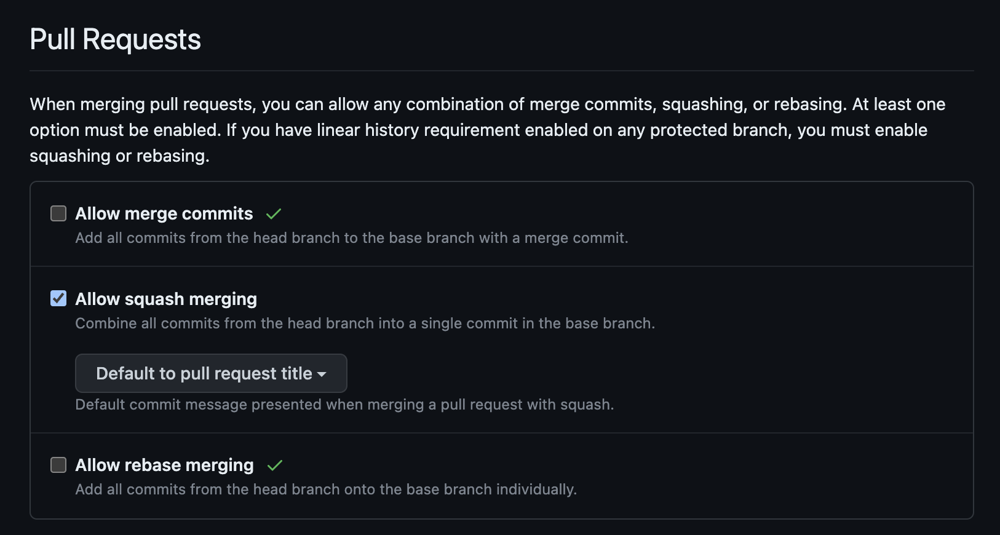

# Create Issue Branch


[](https://codeclimate.com/github/robvanderleek/create-issue-branch/maintainability)
[](https://github.com/robvanderleek/create-issue-branch/actions)
[](https://codecov.io/gh/robvanderleek/create-issue-branch)
[](https://dependabot.com/)
[](https://sentry.io)


A GitHub App/Action that automates the creation of issue branches (either
automatically after assigning an issue or after commenting on an issue with a
ChatOps command: `/create-issue-branch` or `/cib`).

Built in response to this feature request issue:
https://github.com/isaacs/github/issues/1125 (that issue is now closed and the
discussion [continuous
here](https://github.com/github/feedback/discussions/3441) and
[here](https://github.com/github/feedback/discussions/12290))

> [!TIP] 
> UPDATE 2/2/2022**: GitHub added a "Create a branch" button [to the web
> UI](https://github.blog/changelog/2022-03-02-create-a-branch-for-an-issue/)
>
> This App/Action offers some unique features not available in the new GitHub
> web UI button, such as:
>
> - [Configure branch name
>   format](https://github.com/robvanderleek/create-issue-branch#branch-names)
> - [Configure default source
>   branch](https://github.com/robvanderleek/create-issue-branch#default-source-branch)
> - [Configure source branch based on
>   label](https://github.com/robvanderleek/create-issue-branch#source-branch-based-on-issue-label)
> - [Automatically open a (draft) Pull
>   Request](https://github.com/robvanderleek/create-issue-branch#automatically-open-a-pull-request)
> - [Copy over attributes (such as labels and milestones) from the issue to the
>   (draft)
>   PR](https://github.com/robvanderleek/create-issue-branch#copy-attributes-from-issue)
> - [Configure PR target branch based on issue
>   label](https://github.com/robvanderleek/create-issue-branch#pull-request-target-branch-based-on-issue-label)
> - [Feature requests are always
>   welcome!](https://github.com/robvanderleek/create-issue-branch#feedback-suggestions-and-bug-reports)
>
> Perhaps the new GitHub button will be sufficient for your development
> workflow, if not give this App/Action a try.

* [Installation](#installation)
* [Usage](#usage)
* [Configuration](#configuration)
* [Development](#development)
* [Feedback, suggestions and bug reports](#feedback-suggestions-and-bug-reports)
* [Contributing](#contributing)
* [License](#license)

# Installation

There are two options to run this app as part of your development workflow:

1. [Install](https://github.com/marketplace/create-issue-branch) it as an *app* for your organization/account/repository
2. Run it as an *action* in your GitHub action YAML configuration

Option 1 is easiest if you're developing on GitHub.com, option 2 gives you full
control how and when the app runs in your development workflow.

The App is free to use for personal, and public organization repositories. There
is [a paid plan on the GitHub Marketplace](https://github.com/marketplace/create-issue-branch/) if you want to use it
for private organization repositories.

## Option 1. Install the GitHub App

You can install the app for your organization/account/repository from [*the GitHub
Marketplace*](https://github.com/marketplace/create-issue-branch)

## Option 2. Configure GitHub Action

Add this to your workflow YAML configuration:

```yaml
on:
  # The issues event below is only needed for the default (auto) mode,
  # you can remove it otherwise
  issues:
    types: [ assigned ]
  # The issue_comment event below is only needed for the ChatOps mode,
  # you can remove it otherwise
  issue_comment:
    types: [ created ]
  pull_request:
    types: [ closed ]

jobs:
  create_issue_branch_job:
    runs-on: ubuntu-latest
    steps:
      - name: Create Issue Branch
        uses: robvanderleek/create-issue-branch@main
        env:
          GITHUB_TOKEN: ${{ secrets.GITHUB_TOKEN }}
```

*The latest GitHub Marketplace release is not always up-to-date (due
to [this](https://github.community/t/automatically-publish-action-to-marketplace-on-release/17978)). To have access to
all features please use version `@main`*

### GitHub Action output variable

The GitHub Action has one output variable: `branchName`, which contains the
name of the branch that was created, or already exists in the repository. You
can use this output in downstream actions. For a trivial example see [this
workflow](https://github.com/robvanderleek/robvanderleek.github.io/blob/2af5f90d94d81e942382892a6b6149467184b38b/.github/workflows/issue-branch.yml).

## Uninstall

Uninstall the App by navigating to: `Settings > Applications > Installed GitHub Apps > Create Issue Branch > Configure`.
At the bottom of that page there's a button to uninstall the Create Issue Branch app.

You can also use [this link](https://github.com/settings/installations/7740930) to navigate to the configuration page
mentioned above.

# Usage

This app can support your development workflow in two ways (modes): auto and chatops.

In "auto" mode the typical development workflow is:

1. An issue is created, for example: Issue 15: Fix nasty bug!

*some time may pass*

2. The issue is assigned
3. When the issue is assigned this app will create a new issue branch
   (for the example issue this branch will be called `issue-15-Fix_nasty_bug`)

In "chatops" mode the typical development workflow is:

1. An issue is created, for example: Issue 15: Fix nasty bug!

*some time may pass*

2. A developer that wants to work on this issue gives the ChatOps command `/cib` as a comment on the issue
3. This app will create a new issue branch
   (for the example issue this branch will be called `issue-15-Fix_nasty_bug`)
   By default the app notifies creation is completed with a comment on the issue.

## Advanced usage with other Apps & Actions

GitHub Apps & Actions allow you to define custom and advanced automated workflows. Examples of Apps & Actions that can
be used alongside this app to compose tailored issue workflows are:

- [project-bot](https://github.com/philschatz/project-bot): App for project automation
- [github-actions-automate-projects](https://github.com/takanabe/github-actions-automate-projects): Action for project
  automation
- [auto-card-labeler](https://github.com/technote-space/auto-card-labeler): Automatically label issues/PRs

To get inspired of what is possible with Actions workflows,
see [this configuration](https://github.com/takeshape/.github/blob/4ecfb2fb54164934ad70822c709ab1917541114d/.github/workflows/_pm_issues.yml)
.

_Remember to always pick the simplest issue workflow that fits your project_.

# Configuration

This app does not require a configuration. However, if you want to override the
default behaviour you can do so by placing a YAML file in your repository at
the location: `.github/issue-branch.yml` with the overrides.

If the app has a problem with your configuration YAML (e.g.: invalid content)
it will create an issue with the title " Error in Create Issue Branch app
configuration" in the repo. Subsequent runs with an invalid configuration will
not create new issues, only one stays open.

## Organization/User wide configuration

Organization/user wide configuration prevents a configuration in every
individual repo and is supported by putting the YAML file
`.github/issue-branch.yml` in a repository called `.github`. So, if your
organization/username is `acme`, the full path becomes:
`https://github.com/acme/.github/blob/main/.github/issue-branch.yml`.

Remember to give the GitHub App access to the `.github` repository, otherwise
it can't load the organization/user wide configuration.

Reposotory configuration files override the organization/user wide configuration
file.

## Mode: auto or chatops

The default mode is "auto", meaning a new issue branch is created after an issue is assigned.

You can change the mode to "chatops", meaning a new issue branch is created after commenting on an issue
with `/create-issue-branch` or `/cib`, by putting the following line in your `issue-branch.yml`:

```yaml
mode: chatops
```

## Silent or chatty

By default the app comments on the issue after creating a branch.

You can change this default behaviour, and make the app silent, by putting the following line in
your `issue-branch.yml`:

```yaml
silent: true
```

## Branch names

Branch names are generated from the issue, there are 3 built-in flavours or it can be customized.

The 3 built-in flavours are:

1. `tiny` => an `i` followed by the issue number, for example: `i15`
2. `short` => the word `issue` followed by the issue number, for example:
   `issue-15`
3. `full` => the word issue followed by the issue number followed by the issue title, for
   example: `issue-15-Fix_nasty_bug`

The default is `full`, other types can be configured in the YAML like this:

```yaml
branchName: tiny
```

or

```yaml
branchName: short
```

### Substitution placeholders

To customize branch names you can give `branchName` a string value where `${...}`
placeholders are substituted with fields from the GitHub issue or environment variables.

For example, if you would like to have your branch names contain only the issue number and title (similar to the GitLab
branch naming convention), configure it like this:

```yaml
branchName: '${issue.number}-${issue.title}'
```

See
[test/fixtures/issues.assigned.json](tests/test-fixtures/issues.assigned.json) for all possible placeholder names.

Substitution placeholders can also refer to environment variables in GitHub Actions. Environment variable names need to
be prefixed with a `%` character to distinguish them from GitHub issue fields.

For example, if the environment variable `SOME_VAR` is defined outside the action it can be used in a branch name like
this:

```yaml
branchName: '${issue.number}-${%SOME_VAR}-${issue.title}'
```

### Substitution value slicing

Substitution values can be "sliced" with the slice operator: `[start, end]`. This operator behaves exactly like the
[JavaScript String `slice()` method](https://developer.mozilla.org/en-US/docs/Web/JavaScript/Reference/Global_Objects/String/slice)
.

For example, put this in your configuration YAML to limit issue titles to 64 characters:

```yaml
branchName: '${issue.number}-${issue.title[0,64]}'
```

### Lowercase and uppercase substitutions

Substitutions for `${...}` placeholders can be lowercased by putting a `,` before the closing curly. Likewise,
substitutions can be uppercased by putting a `^` before the closing curly.

For example, issue titles can be lowercased in branch names like this:

```yaml
branchName: '${issue.number}-${issue.title,}'
```

or if you want the complete title in uppercase:

```yaml
branchName: '${issue.number}-${issue.title^}'
```

### Left padding with zeros

Substitutions can be left padded with zeros using the `%n` operator, where `n` is the minimum number of characters 
of the substitution result.

For example, issue numbers can be left padded with zeros like this:

```yaml
branchName: 'issue-${issue.number%4}'
```

In the example above, if the issue number is 123, the resulting branch name will be `issue-0123`.

### Configure replacement character and replace arbitrary characters

Characters that are not allowed in Git branch names are replaced by default with an underscore (`_`) character. You can
configure a different replacement character as follows:

```yaml
gitSafeReplacementChar: '-'
```

The above configuration would generate the following branch name for issue 15 that has the title "Fix nasty
bug": `issue-15-Fix-nasty-bug`.

Furthermore, you also can replace arbitrary characters in the branch title:

```yaml
gitReplaceChars: 'ab/'
```

The above configuration replaces all occurences of the characters 'a', 'b' and '/' in the branch title.

## Automatically close issues after a pull request merge

This app can close issues automatically for you when a pull request for an issue branch is merged. You can enable this
feature with:

```yaml
autoCloseIssue: true
```

Be aware that the app needs to be able to find the issue number in the branch name, otherwise this feature will not
work. This feature only works if one of the following is true for your app configuration:

- You use the default `branchName` setting
- Your `branchName` setting is `tiny`, `short` or `full`
- Your branch name starts with the issue number
- Your branch name contains the string `issue-` (case insensitive) followed by the issue number, for
  example: `Project-A-Issue-123-Rewrite_in_Clojure`

## Default source branch

You can override the source branch (by default
the ["default branch"](https://docs.github.com/en/github/administering-a-repository/managing-branches-in-your-repository/changing-the-default-branch)
of the repository is used) in the configuration like this:

```yaml
defaultBranch: 'dev'
```

## Source branch based on issue label

You can override the source branch based on the issue label.

For example, if you want branches for issues with the `enhancement` label to have the `dev` branch as a source, and
branches for issues with the `bug`
label to have the `staging` branch as a source, add this to your configuration YAML:

```yaml
branches:
  - label: enhancement
    name: dev
  - label: bug
    name: staging
```

The `label` field also takes a list of label names. In that case all labels in the list must be matched by labels of the
issue. For example:

```yaml
branches:
  - label:
      - enhancement
      - docs
    name: docs
  - label: enhancement
    name: dev
```

In the configuration above issues with the labels `enhancement` _and_ `docs` will have the `docs` branch as a source,
while issues with an `enhancement` label _but not_ a `docs` label will have the `dev` branch as a source.

When issues have multiple labels the branch of the first match (based on the order in the configuration YAML will be
used).

If a configured branch does not exist in the repository the [default branch](#default-source-branch) is used.

## Branch name prefix based on issue label

Branch names can be prefixed based on the label of an issue.

For example, if you want branches for issues with the `enhancement` label to have the `feature/` prefix and branches for
issues with the `bug` label to have the `bugfix/` prefix, add this to your configuration YAML:

```yaml
branches:
  - label: enhancement
    prefix: feature/
  - label: bug
    prefix: bugfix/
```

You can use `${...}` placeholders in the prefix to substitute fields from the GitHub issue assignment JSON object. For
example, if you want the GitHub login name of the user that created the issue in the branch prefix, add this to your
configuration YAML:

```yaml
branches:
  - label: enhancement
    prefix: feature/${issue.user.login}/
```

See
[test/fixtures/issues.assigned.json](tests/test-fixtures/issues.assigned.json) for all possible placeholder names.

## Skip runs for issues based on issue label

Runs of this App/Action can be skipped based on the label of an issue.

For example, if you don't want to automatically create branches for issues with the
`question` label, add this to your configuration YAML:

```yaml
branches:
  - label: question
    skip: true
```

## Matching labels with wildcards

Wildcard characters '?' (matches any single character) and '&ast;' (matches any sequence of characters, including the
empty sequence) can be used in the label field.

For example, to set the default/fallback prefix `issues/` for issues that do not have the `enhancement`  or `bug`
label, use this configuration:

```yaml
branches:
  - label: enhancement
    prefix: feature/
  - label: bug
    prefix: bugfix/
  - label: '*'
    prefix: issues/
```

You can use this default/fallback behaviour also to run the App/Action only for certain issue labels. For example, put
this in your configuration YAML if you want to run the App/Action only for issues with the `bug` label:

```yaml
branches:
  - label: bug
    skip: false
  - label: '*'
    skip: true
```

*Remember to put quotes around a single asterisk ('&ast;') in YAML*

## Automatically open a Pull Request

Automatically open a (draft) Pull Request for the newly created branch. Enable this feature in your configuration YAML,
for draft pull requests use:

```yaml
openDraftPR: true
```

and for regular pull requests use:

```yaml
openPR: true
```

Be aware that draft pull requests are not available in all repositories types, see
the [GitHub documentation](https://docs.github.com/en/free-pro-team@latest/github/collaborating-with-issues-and-pull-requests/about-pull-requests#draft-pull-requests)
for details.

### Pull Request target branch based on issue label

You can override the pull request target branch based on the issue label.

For example, if you want (draft) pull requests for issues with the `bug` label to have the `development` branch as a
source and have the pull request target branch set to `hotfix`, add this to your configuration YAML:

```yaml
branches:
  - label: bug
    name: development
    prTarget: hotfix
```

### Skip branch creation based on issue label

You can skip the creation of branches based on the issue label. This configuration option is typically used together
with the `openPR`/`openDraftPR` option to automatically create a (draft)PR between branches.

For example, to automatically open a PR to merge the `develop` branch in the `release` branch when the issue has a 
`release` label, add this to your configuration YAML:

```yaml
openPR: true
branches:
  - label: release
    name: develop
    prTarget: release
    skipBranch: true
```

### Copy attributes from issue

When the App opens a new (draft) Pull Request it can also copy over the following attributes from your issue:

- Description
- Labels
- Assignee
- Projects (*only available in GitHub Action, not in the App*)
- Milestone

You can enable this behaviour per attribute in the configuration:

```yaml
copyIssueDescriptionToPR: true
copyIssueLabelsToPR: true
copyIssueAssigneeToPR: true
copyIssueProjectsToPR: true
copyIssueMilestoneToPR: true
```

### Skip CI workflows

Automatically opening a (draft) PR for an issue requires an empty commit on the newly created branch (this is a
requirement by GitHub). This first empty commit might trigger GitHub Actions CI workflows. You can skip these
workflows with the following configuration option:

```yaml
prSkipCI: true
```

## Conventional Pull Request titles

When this option is enabled, a [Conventional
Commit](https://www.conventionalcommits.org/) prefix (including a
[gitmoji](https://gitmoji.dev/)) is automatically added to the PR title based
on issue & PR labels.

For example, if there's an issue "Fix nasty bug" and accompanying branch
`issue-123-Fix-nasty-bug`, where either the issue or the PR are labeled as
"bug", then whenever a Pull Request for the branch is opened (automatically or
manually) Create Issue Branch will prepend "fix: 🐛" to the Pull Request title,
for example "fix: 🐛 isssue 123 Fix nasty bug". 

Conventional PR titles create a clear and beautiful Git history. They also make
it possible to implement automated [Semantic Versioning](https://semver.org/)
of your software using tools such as [Semantic
Release](https://semantic-release.gitbook.io/semantic-release/).

By default, for issues/PRs that are labeled with "breaking change" (or
"breaking-change") there will be an exclamation mark added to the title, for
example: "feat!: ✨ Change in API".

You can enable conventional Pull Request titles with the following
configuration option:

```yaml
conventionalPrTitles: true
```

This feature works best if you enable only "Allow squash merging" on your
repository settings page:



### Configuring Conventional Pull Requests style

There are three prefix styles you can select: semver (default),
semver-no-gitmoji, and gitmoji. You can configure the prefix style with the
following configuration option:

```yaml
conventionalStyle: semver
```

or:

```yaml
conventionalStyle: semver-no-gitmoji
```

or:

```yaml
conventionalStyle: gitmoji
```

#### semver (default) example

With the "semantic versioning" (`semver`) style, Create Issue Branch will
prepend "fix: 🐛" to the Pull Request title, for example "fix: 🐛 isssue 123
Fix nasty bug"

#### semver-no-gitmoji example

With the `semver-no-gitmoji` style, Create Issue Branch will prepend "fix: " to
the Pull Request title, for example "fix: isssue 123 Fix nasty bug"

#### gitmoji example

With the `gitmoji` style, Create Issue Branch will prepend "🐛 " to the Pull
Request title, for example "🐛 isssue 123 Fix nasty bug"


### Configuring Conventional Pull Request prefixes

Prefixes and emoji's for labels can be configured through the option
`conventionalLabels`. This is the default:

```yaml
conventionalLabels:
  fix:
    bug: '🐛'
    dependencies: '⬆️'
    security: '🔒'
  feat:
    enhancement: '✨'
  build:
    build: '🔧'
  chore:
    chore: '♻️'
  ci:
    ci: '👷'
  docs:
    documentation: '📝'
  style:
    style: '💎'
  refactor:
    refactor: '♻️'
  perf:
    performance: '⚡️'
  test:
    test: '✅'
  breaking:
    breaking-change: '💥'
    breaking change: '💥'
```

For example, to change the emoji for label "bug":

```yaml
conventionalLabels:
  fix:
    bug: '🚑'
```

Or to add a new label type for features:

```yaml
conventionalLabels:
  feat:
    new-stuff: '🚀'
```

Or to add a new prefix:

```yaml
conventionalLabels:
  my-prefix:
    my-label: '🏷️'
    breaking: true
```

Note: for backwards compatibility, `features` and `feat` will both result in a
prefix `feat`.

## Change message in issue comments

The default message displayed in the issue comments after a branch is created (and
[silent mode](#silent-or-chatty) is not enabled) is:

```
Branch ${branchName} created!
```

You can customize this message with the `commentMessage` option in the configuration YAML. In the string value for this
option `${branchName}` is substituted with the name of the newly created branch and other `${...}` placeholders are
substituted with fields from the GitHub issue assignment JSON object.

For example, if you would like to have the original issue title in the comment, confgure it like this:

```yaml
commentMessage: 'Branch ${branchName} created for issue: ${issue.title}'
```

See
[test/fixtures/issues.assigned.json](tests/test-fixtures/issues.assigned.json) for all possible placeholder names.

## Experimental features

The features below are experimental and may be removed some day or promoted to standard features.

### Branch name as ChatOps command argument

As discussed in [this issue](https://github.com/robvanderleek/create-issue-branch/issues/127), enabling this feature
allows you to give the branch name as an argument to the `/cib` ChatOps command. For example: `/cib Simple NPE fix` will
create a branch named `issue-1-Simple_NPE_fix`

```yaml
experimental:
  branchNameArgument: true
```

# Development

## Unit Test Coverage

#### Jest/Istanbul:

Unit Tests and coverage are implemented using Jest and Istanbul.

The snippet below shows the script which, upon execution, generates a coverage directory with coverage reports that are
then used by CodeCov to generate a dashboard (*description for CodeCov below the snippet*)

```javascript 
"coverage"
:
"jest --collect-coverage"
```

#### CodeCov

Note: CodeCov is a third-party test coverage tool which can be associated to your GitHub repository to create a
dashboard based on visual representations of test coverage. CodeCov also tracks improvements in coverage on every push
once linked. For more information: https://docs.codecov.io/docs

Used CodeCov to generate a coverage dashboard through a bash command run in the prod/dev pipelines.

The bash script can only run if:

* You have a 'codecov' account (just log in with your GitHub account)
* The repository on your GitHub account is linked to your CodeCov account.
* You have a GitHub secret named `CODECOV_SECRET_TOKEN` which has the value of the token generated by CodeCov

Please note that once your repository is linked with your CodeCov account you will receive an authentication token
generated by CodeCov which you will have to save as `CODECOV_SECRET_TOKEN` in your GitHub secrets for this repository.
The bash script upon execution will provide a link to your CodeCov dashboard on your account.

The snippet below shows the workflow which runs the coverage command through yarn and bash script to generate a
dashboard on CodeCov.io:

```yaml
 - run: yarn run coverage
 - run: bash <(curl -s https://codecov.io/bash) -t ${{secrets.CODECOV_SECRET_TOKEN }}
```

# Feedback, suggestions and bug reports

Please create an issue here:
https://github.com/robvanderleek/create-issue-branch/issues

If you like this Action/App, please star :star: it.

## Star history

[](https://star-history.com/#robvanderleek/create-issue-branch&Date)

## Features under consideration

The list below contains features that might or might not be implemented in the future. Comment or +1 if this feature is
useful for your use-case.

- Add Projects integration (see issue [#142](https://github.com/robvanderleek/create-issue-branch/issues/142))
- Add issue label management functionality (see
  issue [#177](https://github.com/robvanderleek/create-issue-branch/issues/177))
- Choose branch to branch from in ChatOps mode (see
  issues [#155](https://github.com/robvanderleek/create-issue-branch/issues/155)
  and [#213](https://github.com/robvanderleek/create-issue-branch/issues/213))

# Contributing

If you have suggestions for how create-issue-branch could be improved, or want
to report a bug, [open an
issue](https://github.com/robvanderleek/create-issue-branch/issues)! All and
any contributions are appreciated.

For more, check out the [Contributing Guide](docs/CONTRIBUTING.md).

# License

[ISC](LICENSE) © 2019 Rob van der Leek <robvanderleek@gmail.com>
(https://twitter.com/robvanderleek)
